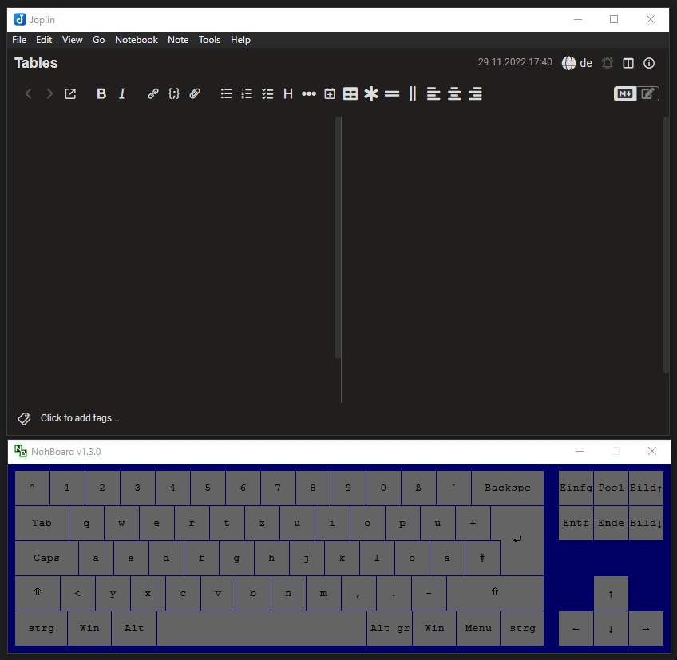
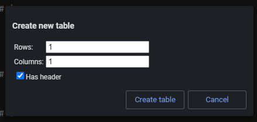
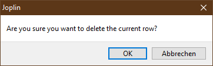

> **Warning** This plugin is currently in development and isn't released yet.

<table>
    <tr>
        <td colspan="3" align="center">
            <h3>MultiMarkdown Table Tools</h3>
        </td>
    </tr>
    <tr>
        <td rowspan="6" align="center">
             
            

                <strong>Joplin Plugin</strong> 
                MultiMarkdown Table Tools
            

        </td>
    </tr>
    <tr>
        <td colspan="2"><strong>A collection of tools to make editing tables easier.</strong></td>
    </tr>
    <tr>
        <td colspan="2">
            <!-- Placeholder -->
            
            
        </td>
    </tr>
    <tr>
        <td>Built with:</td>
        <td>
            <a href="https://github.com/laurent22/joplin/tree/dev/packages/generator-joplin">generator-joplin</a>,
            <a href="https://github.com/FelisDiligens/md-table-tools">md-table-tools</a>,
            <a href="https://github.com/mixmark-io/turndown">turndown</a>,
            <a href="https://github.com/redbug312/markdown-it-multimd-table">markdown-it-multimd-table</a>
        </td>
    </tr>
    <tr>
        <td>Inspired by:</td>
        <td>
            <a href="https://github.com/roman-r-m/joplin-plugin-table-formatter">Table Formatter Plugin</a>,
            <a href="https://github.com/kensam94/joplin-plugin-eztable">Ez Table</a>,
            <a href="https://github.com/coderrsid/paste-special">Paste Special Plugin</a>,
            <a href="https://github.com/CalebJohn/joplin-rich-markdown">Rich Markdown</a>
        </td>
    </tr>
    <tr>
        <td>Other plugins by me:</td>
        <td>
            <a href="https://github.com/FelisDiligens/joplin-plugin-cmoptions">CodeMirror Options</a>
        </td>
    </tr>
</table>

    <a href="#-features">Features</a> |
    <a href="#-screenshots">Screenshots</a> |
    <a href="#%EF%B8%8F-installation">Installation</a> |
    <a href="#-usage">Usage</a> |
    <a href="#hotkeys">Hotkeys</a> |
    <a href="#-known-issues">Known issues</a>

## ✨ Features

### Edit tables
- Create new tables with a dialog.
- Format and minify Markdown tables (without breaking MultiMarkdown tables).
- Add, delete, and move table rows and columns.
- Align text left, center, or right.
- Jump to next or previous cell with `Tab` and `Shift` + `Tab`.
- Adds hotkeys, [see below](#hotkeys). *(opt-out)*
- Paste HTML or CSV tables as Markdown.
- Convert tables between HTML, Markdown, and CSV.

### Configurable
- Choose between MultiMarkdown or GitHub Flavored Markdown table format in the settings. *(personal preference, MultiMarkdown is default)*
- Disable features if you don't like them *(toolbar buttons, contextmenu items, hotkeys)*.
  - This also makes this plugin compatible with other plugins that use the same hotkeys or equally named contextmenu items.
- Change how `Tab` and `Enter` behave or disable them separately.

### Markdown-it extension
- Enable a forked version of the `markdown-it-multimd-table` extension in the settings. *(opt-in)*
  - Allows you to place table captions below a table. See [this forum post](https://discourse.joplinapp.org/t/multimarkdown-table-captions-above-table-not-below/2819).

## 📸 Screenshots

[See more screenshots!](Screenshots.md)

## ⚙️ Installation

### From the repo (recommended)

- Go to the settings (Tools → Options) → Plugins
- Search for `MultiMarkdown Table Tools`
- Click 'Install' and restart Joplin
- Enjoy

### Manually

- Download the *.jpl file from the [releases](https://github.com/FelisDiligens/joplin-plugin-multimd-table-tools/releases) section
- Go to the settings (Tools → Options) → Plugins
- Click the gear next to 'Manage your plugins' and choose 'Install from file'
- Select the downloaded *.jpl file
- Restart Joplin
- Enjoy

## ⚡ Usage

All actions are relative to where you placed the I-beam (also called I-cursor) in the text editor. This includes hotkeys.

Once you place the I-beam, simply select one of the actions from the menu (see `Tools` → `Table tools`), click a button from the toolbar, or press a hotkey.

### Hotkeys

| Hotkey                          | Action                           |
|---------------------------------|----------------------------------|
| `Tab`                           | Jump to next cell                |
| `Shift` + `Tab`                 | Jump to previous cell            |
| `Enter`                         | Insert ` ` instead of newline |
| `Cmd` or `Ctrl` + `Enter`       | Insert row below                 |
| `Cmd` or `Ctrl` + `Tab`         | Insert column to the right       |
| `Cmd` or `Ctrl` + `Shift` + `F` | Format current table             |

All of these actions can also be performed from the menu (e.g. Tools → Table tools → Row → Insert below).

## 🐛 Known issues

### Broken dialogs

<em>(Click to see how it's supposed to look like...)</em>

Every now and then the plugin swallows up its dialogs. There doesn't seem to be anything I can do to fix this.  
If that happens to you, click "Cancel" and try again.

Also, if this happens all the time, you can enable these (working) dialogs in the advanced settings and they'll show up whenever feasible:

### Only every second table gets formatted

It could be that only every second table gets formatted, when you click `Format all tables`.  
If that happens to you, click `Format all tables` twice or format each table with `Format table`.

### Right-click doesn't do anything in text editor

This can happen sometimes, especially if you change settings.  
Try to restart Joplin.

<!--
## ☕ I can haz coffee?

If you like this plugin, consider to support me on ☕ ko-fi:

-->

## Development

Text from "generator-joplin"

This is a template to create a new Joplin plugin.

The main two files you will want to look at are:

- `/src/index.ts`, which contains the entry point for the plugin source code.
- `/src/manifest.json`, which is the plugin manifest. It contains information such as the plugin a name, version, etc.

## Building the plugin

The plugin is built using Webpack, which creates the compiled code in `/dist`. A JPL archive will also be created at the root, which can use to distribute the plugin.

To build the plugin, simply run `npm run dist`.

The project is setup to use TypeScript, although you can change the configuration to use plain JavaScript.

## Updating the plugin framework

To update the plugin framework, run `npm run update`.

In general this command tries to do the right thing - in particular it's going to merge the changes in package.json and .gitignore instead of overwriting. It will also leave "/src" as well as README.md untouched.

The file that may cause problem is "webpack.config.js" because it's going to be overwritten. For that reason, if you want to change it, consider creating a separate JavaScript file and include it in webpack.config.js. That way, when you update, you only have to restore the line that include your file.

