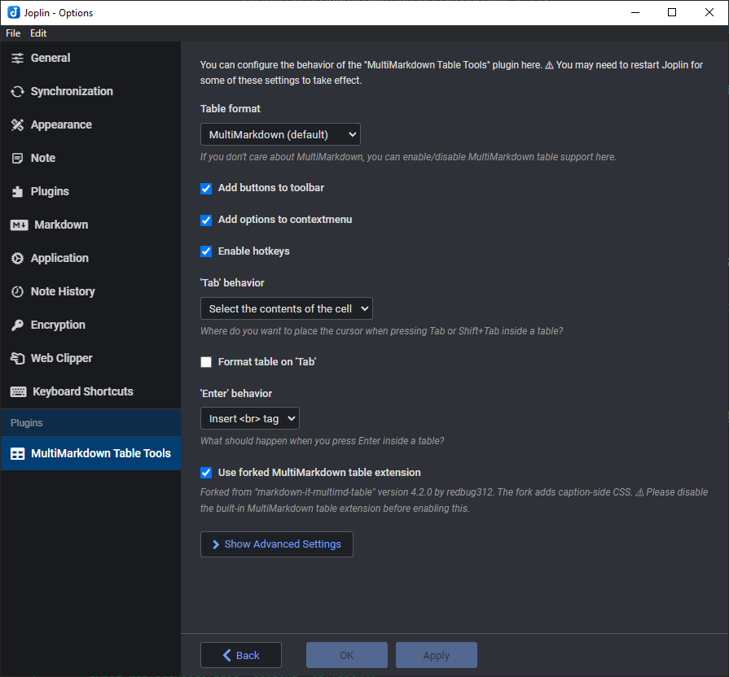

# Screenshots

[Go back to Readme](README.md)

  
*Use hotkeys while typing.*
  

  
*Format and minify tables.*
  

  
*Use `Tab` and `Shift` + `Tab` to jump.*
  

  
*Convert between HTML, Markdown, and CSV.*
  

  
*Some actions are added to the toolbar.*
  

  
*You can find **all** actions under `Tools` → `Table tools`.*
  

  
*Customize it to your taste.*
  

[Go back to Readme](README.md)